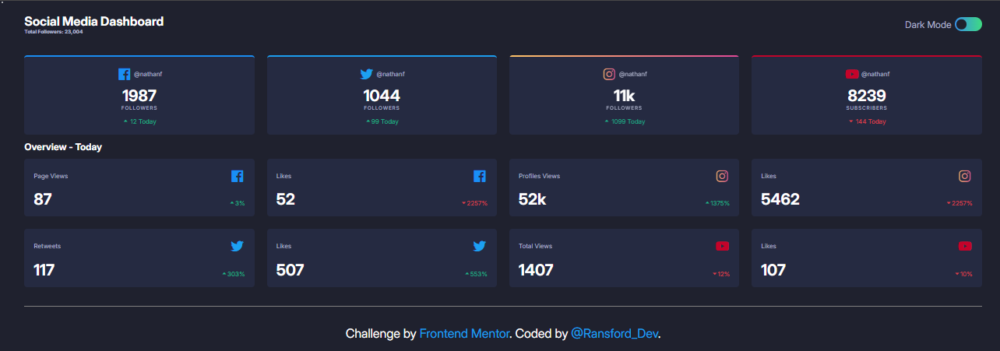
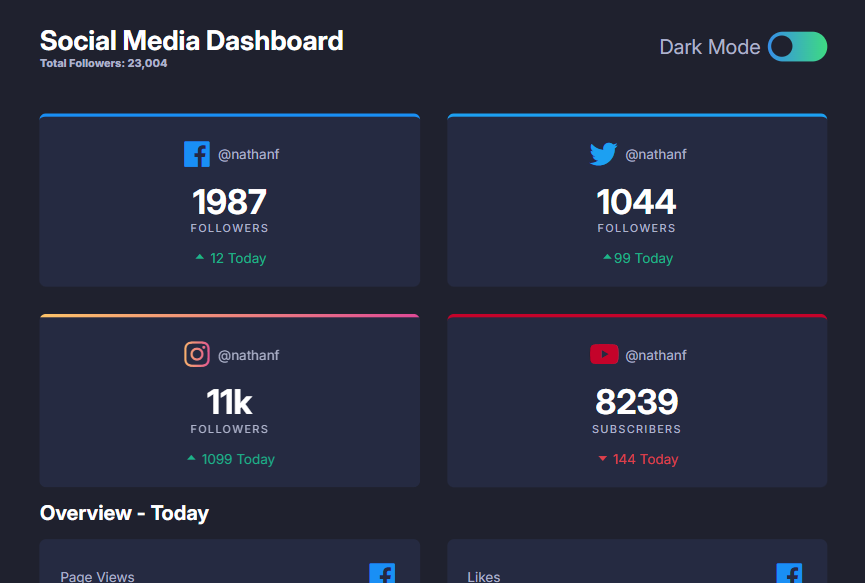
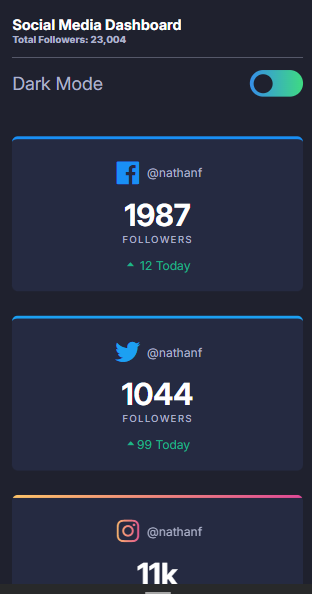

# Frontend Mentor - Social media dashboard with theme switcher solution

This is a solution to the [Social media dashboard with theme switcher challenge on Frontend Mentor](https://www.frontendmentor.io/challenges/social-media-dashboard-with-theme-switcher-6oY8ozp_H). Frontend Mentor challenges help you improve your coding skills by building realistic projects. 

## Table of contents

- [The challenge](#the-challenge)
- [Screenshot](#screenshot)
- [Links](#links)
- [Built with](#built-with)
- [What I learned](#what-i-learned)
- [Continued development](#continued-development)
- [Useful resources](#useful-resources)
- [Author](#author)

## The challenge

Users should be able to:

- View the optimal layout for the site depending on their device's screen size
- See hover states for all interactive elements on the page
- Toggle color theme to their preference

### Screenshot

### Links

- Solution URL: [(https://ransfordrash.github.io/Social-media-dashboard/)]
- Github Repo URL: [https://github.com/Ransfordrash/Social-media-dashboard.git]

### Built with

- Semantic HTML5 markup
- CSS custom properties
- Flexbox
- CSS Grid
- Mobile-first workflow
- [Sass version Scss]
- [Icons Components](https://boxicons.com/) - For icons

### What I learned

Since I started coding i've never try to build anything on my own so when i tried this challenge i can see at least am getting better than before and my favorite part in this mini project is the theme switch i struggle for goggling to find the right resource all thanks to Kelvin Powel the youtuber.

### Continued development

I am planning now to focus more on javascript after complete another three challenge on Frontend mentor

### Useful resources

- [Youtube](https://www.youtube.com) - Like i said previously Kelvin Powel helped me a lot not in this project but overall.
- [Free Code Camp](https://www.freecodecamp.org) - Well if i will be named a software engineer one day it would not be without free code camp i learn everything from scratch.

## Author

- Frontend Mentor - [@Ransfordrash](https://www.frontendmentor.io/profile/Ransfordrash)
- Twitter - [@Jin_0z](https://www.twitter.com/Jin_0z)
